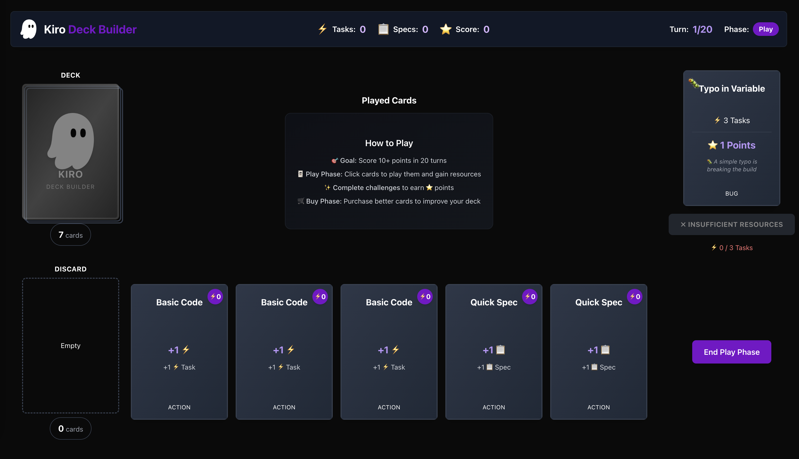

# Kiro Deck Builder

A coding-themed deck building card game built with Next.js.



## Project Structure

```
kiro-deck-builder/
├── app/                    # Next.js App Router pages
│   ├── layout.js          # Root layout with Kiro theme
│   ├── page.js            # Main game page
│   └── globals.css        # Global styles with Kiro colors
├── components/            # React components
├── lib/                   # Game logic and utilities
├── context/               # React context providers
├── __tests__/            # Test files
│   ├── unit/             # Unit tests
│   └── properties/       # Property-based tests
├── logs/                 # Server logs
└── assets/               # Static assets (Kiro logo)
```

## Tech Stack

- **Framework**: Next.js 14 (App Router)
- **Language**: JavaScript
- **UI Library**: Tailwind CSS with Kiro brand colors
- **Animation**: Framer Motion
- **Testing**: Vitest + fast-check (property-based testing)

## Kiro Brand Colors

- **Purple-500**: `#790ECB` - Primary brand color
- **Purple-400**: Lighter purple for hover states
- **Purple-300**: Lightest purple for text links
- **Black-900**: Dark background
- **Prey-900/750/700**: Gray shades for cards and containers

## Getting Started

### Prerequisites

- Node.js >= 18.17.0
- npm >= 8.0.0

### Installation

Dependencies are already installed. If you need to reinstall:

```bash
npm install
```

### Development

Start the development server:

```bash
npm run dev
```

Open [http://localhost:3000](http://localhost:3000) in your browser.

### Testing

Run all tests:

```bash
npm test
```

Run tests in watch mode:

```bash
npm test -- --watch
```

### Build

Build for production:

```bash
npm run build
npm start
```

## Game Overview

Players use coding-themed cards to generate Task points and Specs, which are used to complete bugs and features for points. The game combines deck-building mechanics with resource management over 20 turns.

## Next Steps

Follow the implementation plan in `.kiro/specs/kiro-deck-builder/tasks.md` to build out the game features.
